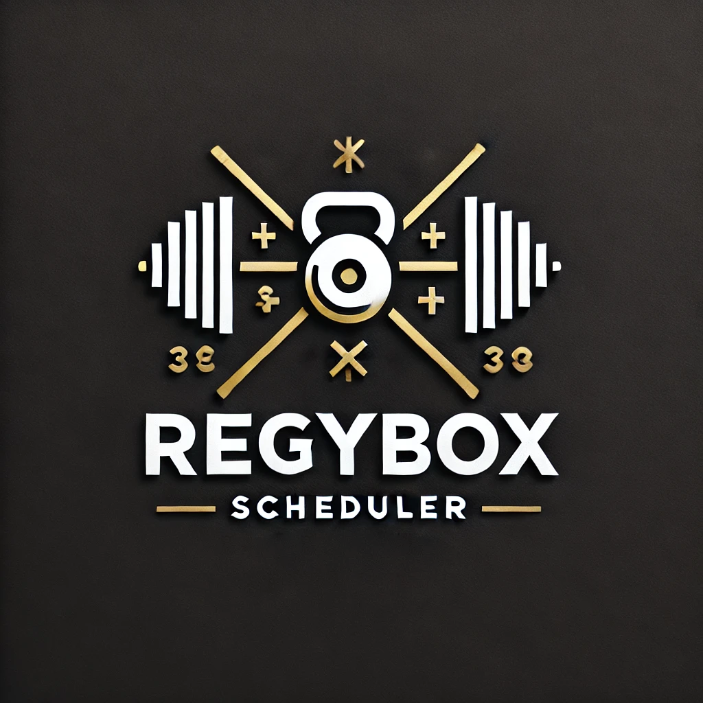
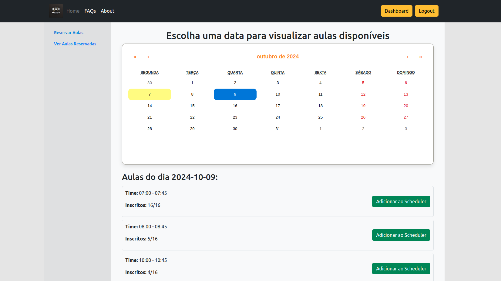

<!-- Improved compatibility of back to top link: See: https://github.com/othneildrew/Best-README-Template/pull/73 -->
<a name="readme-top"></a>
<!--
*** Thanks for checking out the Best-README-Template. If you have a suggestion
*** that would make this better, please fork the repo and create a pull request
*** or simply open an issue with the tag "enhancement".
*** Don't forget to give the project a star!
*** Thanks again! Now go create something AMAZING! :D
-->


<!-- PROJECT SHIELDS -->
<!--
*** I'm using markdown "reference style" links for readability.
*** Reference links are enclosed in brackets [ ] instead of parentheses ( ).
*** See the bottom of this document for the declaration of the reference variables
*** for contributors-url, forks-url, etc. This is an optional, concise syntax you may use.
*** https://www.markdownguide.org/basic-syntax/#reference-style-links
-->
[![Contributors][contributors-shield]][contributors-url]
[![Forks][forks-shield]][forks-url]
[![Stargazers][stars-shield]][stars-url]
[![Issues][issues-shield]][issues-url]
[![MIT License][license-shield]][license-url]


<!-- PROJECT LOGO -->
<br />
<div align="center">
  <a href="https://github.com/andrefdre/RegyBox_API">
    
  </a>

<h3 align="center">Regybox API</h3>

  <p align="center">
    Consists of an API to make the job of scheduling classes in the Regibox app easier.
    <br />
    <a href="https://github.com/andrefdre/RegyBox_API/wiki"><strong>Explore the Wiki »</strong></a>
    <br />
    <br />
    <!-- <a href="https://youtu.be/vULnTanHHmM">View Demo</a>
    · -->
    <a href="https://github.com/andrefdre/RegyBox_API/issues">Report Bug</a>
    ·
    <a href="https://github.com/andrefdre/RegyBox_API/issues">Request Feature</a>
  </p>
</div>


<!-- TABLE OF CONTENTS -->
<details>
  <summary>Table of Contents</summary>
  <ol>
    <li>
      <a href="#about-the-project">About The Project</a>
    </li>
    <li>
      <a href="#getting-started">Getting Started</a>
      <ul>
        <li><a href="#prerequisites">Prerequisites</a></li>
        <li><a href="#installation">Installation</a></li>
      </ul>
    </li>
    <li><a href="#usage">Usage</a></li>
    <li><a href="#contributing">Contributing</a></li>
    <li><a href="#license">License</a></li>
    <li><a href="#contact">Contact</a></li>
    <li><a href="#acknowledgments">Acknowledgments</a></li>
  </ol>
</details>


<!-- ABOUT THE PROJECT -->
## About The Project
<div align="center">

</div>

This project was developed to make scheduling  classes in the Regibox app easier. It has all the necessary tools to send requests to the Regibox API and get the necessary information to schedule classes. It also has a web interface to make the process easier.
<p align="right">(<a href="#readme-top">back to top</a>)</p>


### Built With

* [![Django][Django.com]][Django-url]
* [![React][React.js]][React-url]
* [![Bootstrap][Bootstrap.com]][Bootstrap-url]
* [](https://docs.python-requests.org/en/master/)

<p align="right">(<a href="#readme-top">back to top</a>)</p>


<!-- GETTING STARTED -->
## Getting Started

This project uses requests to send and receive data from the Regibox. It also uses a web interface to make the process easier.

If you only want the api to communicate with the Regibox, you can use the Regybox_API.py file under base folder. If you want to use the web interface, follow the next steps 

### Prerequisites
1. To install the project, clone the repository:

```
git clone https://github.com/andrefdre/RegyBox_API.git
```

2. Install the requirements:

```
cd backend
pip install -r requirements.txt
```

3. Create a .env file in the backend folder with the following variables:

```
SECRET_KEY=your_secret_key
```

4. Create a .env file in the frontend folder with the following variables:

```
REACT_APP_BACK_END_IP = your_ip_address
```


### Installation

1. Make Migrations for the app

```
python3 manage.py makemigrations
```

2. Migration

```
python3 manage.py migrate
```

3. Install the frontend dependencies

```
cd ..
cd frontend
npm install
```

<p align="right">(<a href="#readme-top">back to top</a>)</p>

<!-- USAGE EXAMPLES -->
## Usage

1. Run the server and the frontend

```
npm start_both_apps
```

If you want to run the server and the frontend separately, you can use the following commands:

```
npm start-react
```

```
npm start-django
```

To access the web interface, go to http://localhost:3000

##### If you want to deploy the project with docker, you can use the following command:

```
docker-compose up --build
```

To run the docker container in the background, you can use the following command:

```
docker-compose up -d
```


<p align="right">(<a href="#readme-top">back to top</a>)</p>

<!-- CONTRIBUTING -->
## Contributing

If you have a suggestion that would make this better, please fork the repo and create a pull request. You can also simply open an issue with the tag "enhancement".
Don't forget to give the project a star! Thanks again!

1. Fork the Project
2. Create your Feature Branch (`git checkout -b feature/AmazingFeature`)
3. Commit your Changes (`git commit -m 'Add some AmazingFeature'`)
4. Push to the Branch (`git push origin feature/AmazingFeature`)
5. Open a Pull Request

<p align="right">(<a href="#readme-top">back to top</a>)</p>


<!-- LICENSE -->
## License

Distributed under the GPL License. See `LICENSE.txt` for more information.

<p align="right">(<a href="#readme-top">back to top</a>)</p>


<!-- CONTACT -->
## Contact

André Cardoso - andref@ua.pt

Project Link: [RegyBox API](https://github.com/andrefdre/RegyBox_API)

<p align="right">(<a href="#readme-top">back to top</a>)</p>


<!-- MARKDOWN LINKS & IMAGES -->
<!-- https://www.markdownguide.org/basic-syntax/#reference-style-links -->
[contributors-shield]: https://img.shields.io/github/contributors/andrefdre/RegyBox_API.svg?style=for-the-badge
[contributors-url]: https://github.com/andrefdre/RegyBox_API/graphs/contributors
[forks-shield]: https://img.shields.io/github/forks/andrefdre/RegyBox_API.svg?style=for-the-badge
[forks-url]: https://github.com/andrefdre/RegyBox_API/network/members
[stars-shield]: https://img.shields.io/github/stars/andrefdre/RegyBox_API.svg?style=for-the-badge
[stars-url]: https://github.com/andrefdre/RegyBox_API/stargazers
[issues-shield]: https://img.shields.io/github/issues/andrefdre/RegyBox_API.svg?style=for-the-badge
[issues-url]: https://github.com/andrefdre/RegyBox_API/issues
[license-shield]: https://img.shields.io/github/license/andrefdre/RegyBox_API.svg?style=for-the-badge
[license-url]: https://github.com/andrefdre/RegyBox_API/blob/master/LICENSE.txt
[product-screenshot]: Docs/logo.svg


[Next.js]: https://img.shields.io/badge/next.js-000000?style=for-the-badge&logo=nextdotjs&logoColor=white
[Next-url]: https://nextjs.org/
[React.js]: https://img.shields.io/badge/React-20232A?style=for-the-badge&logo=react&logoColor=61DAFB
[React-url]: https://reactjs.org/
[Bootstrap.com]: https://img.shields.io/badge/Bootstrap-563D7C?style=for-the-badge&logo=bootstrap&logoColor=white
[Bootstrap-url]: https://getbootstrap.com
[Django.com]: https://img.shields.io/badge/Django-092E20?style=for-the-badge&logo=django&logoColor=white
[Django-url]: https://www.djangoproject.com/